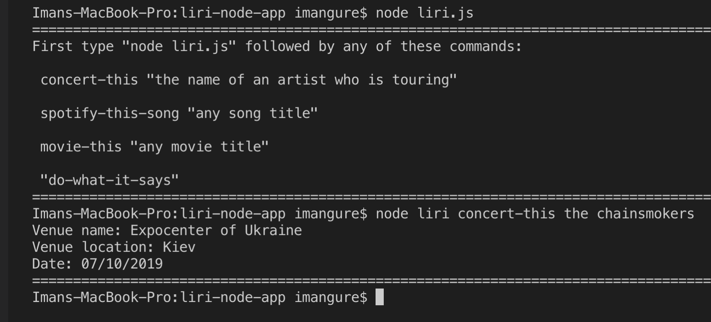

# -liri-node-app

##- A Node based SIRI CLI app that makes searches to Spotify, BandsInTown, and OMDB API's.

To begin just type "node liri.js" in the command line and hit enter

Search Concerts with Bands In Town

To search for a concert just type "node liri concert-this any artist who is touring". LIRI will then take the search and apply it to the Bands In Town API and return the soonest result for a concert for that artist. Below is an image of a BandsInTown search.

